# My Projects for Consideration

Below are the five projects that best demonstrate my technical skills, problem-solving abilities, and hands-on experience. These projects highlight my expertise in design, development, implementation, and real-world application.

## Projects Covered

| # | Project | Domain | Core Stack | Architecture Focus |
|---|---------|--------|------------|--------------------|
| 1 | AstroKundli AI | Vedic astrology intelligence | Python, LLM, RAG, APIs, Microservices | Scalable chatbot, retrieval, deterministic astrology APIs, recommendation engine |
| 2 | FridgeVision | Ingredient recognition and meal planning | Python, YOLOv8, OpenCV, React, Node.js, IoT | Real-time CV, edge-cloud inference, inventory sync, event-driven meal planning |
| 3 | VitalSense | Preventive health monitoring | Python, OpenCV, Deep Learning, ROS2, PyQt | Multimodal perception, low-latency health signals, future robotics/digital twin integration |
| 4 | YOLOv8 Real-Time Object Detection Framework | Reusable object detection platform | Python, YOLOv8, OpenCV, MLOps, TensorRT | Dataset lifecycle, training, evaluation, quantized serving, robotics transfer |
| 5 | EmpathBot | Emotion-aware HRI | Python, Computer Vision, ROS2, HRI | Real-time affect detection, ROS2 messaging, adaptive robot response policies |

## Table of Contents

- [Portfolio Architecture Principles](#portfolio-architecture-principles)
- [Suggested Monorepo Structure](#suggested-monorepo-structure)
- [Shared Platform Architecture](#shared-platform-architecture)
- [Project 1: AstroKundli AI](#project-1-astrokundli-ai)
- [Project 2: FridgeVision](#project-2-fridgevision)
- [Project 3: VitalSense](#project-3-vitalsense)
- [Project 4: YOLOv8 Real-Time Object Detection Framework](#project-4-yolov8-real-time-object-detection-framework)
- [Project 5: EmpathBot](#project-5-empathbot)
- [Cross-Project Engineering Patterns](#cross-project-engineering-patterns)
- [Security, Privacy, and Responsible AI](#security-privacy-and-responsible-ai)
- [Deployment Strategy](#deployment-strategy)
- [Roadmap](#roadmap)
- [Project 6: Blackjack V3](#project-6-blackjack-v3) in progress........

## Portfolio Architecture Principles

This portfolio is designed around production AI engineering practices rather than isolated model experiments.

1. **Separation of concerns**
   - Data ingestion, preprocessing, inference, retrieval, recommendation, UI, and monitoring are separated into independent modules or services.

2. **Hybrid deterministic and generative intelligence**
   - Rule-based or API-backed deterministic systems are used for factual calculations.
   - LLMs are used for conversational reasoning, explanation, summarization, and personalization.

3. **Low-latency inference-first design**
   - Real-time systems use optimized OpenCV/YOLO pipelines, batching, quantization, TensorRT, local caching, and edge inference where appropriate.

4. **MLOps-ready lifecycle**
   - Data versioning, annotation, augmentation, training, evaluation, model registry, optimized serving, and feedback loops are treated as first-class components.

5. **Edge-cloud flexibility**
   - Computer vision and robotics workloads can run locally on edge devices, while heavier orchestration, analytics, storage, and recommendation workloads run in the cloud.

6. **Human-centered AI**
   - Outputs are designed to be explainable, confidence-aware, and safe for end users.

## Suggested Monorepo Structure

```text
ai-ml-architecture-portfolio/
├── README.md
├── docs/
│   ├── architecture/
│   ├── adr/
│   ├── api-contracts/
│   └── diagrams/
├── shared/
│   ├── config/
│   ├── observability/
│   ├── auth/
│   ├── logging/
│   └── utils/
├── projects/
│   ├── astrokundli-ai/
│   │   ├── services/
│   │   ├── rag/
│   │   ├── llm-orchestration/
│   │   ├── astrology-engine/
│   │   └── api-gateway/
│   ├── fridgevision/
│   │   ├── cv-pipeline/
│   │   ├── inventory-service/
│   │   ├── meal-planner/
│   │   ├── frontend/
│   │   └── iot-integrations/
│   ├── vitalsense/
│   │   ├── perception/
│   │   ├── multimodal-fusion/
│   │   ├── pyqt-app/
│   │   └── ros2-bridge/
│   ├── yolov8-object-detection/
│   │   ├── data/
│   │   ├── training/
│   │   ├── evaluation/
│   │   ├── optimization/
│   │   └── serving/
│   └── empathbot/
│       ├── ros2-nodes/
│       ├── perception/
│       ├── behavior-policy/
│       └── robot-interface/
├── infra/
│   ├── docker/
│   ├── kubernetes/
│   ├── terraform/
│   └── monitoring/
└── tests/
    ├── unit/
    ├── integration/
    ├── load/
    └── model-validation/
```

## Shared Platform Architecture

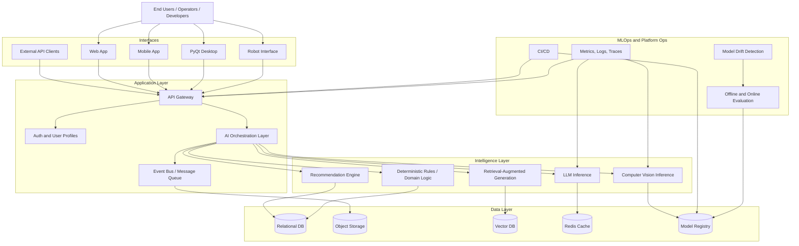

---

# Project 1: AstroKundli AI

## Overview

**AstroKundli AI** is a scalable Vedic astrology intelligence platform that combines deterministic astrology APIs, microservices, retrieval-augmented generation, and LLM-based conversational reasoning. The platform is designed to generate Kundli charts, support matchmaking, analyze doshas, and provide personalized remedial suggestions through an intelligent chatbot.

## Core Capabilities

- Kundli and birth chart generation
- Matchmaking and compatibility analysis
- Dosha detection and explanation
- Personalized remedial recommendations
- Conversational chatbot for astrology queries
- Retrieval-augmented responses grounded in astrology knowledge sources
- High-concurrency backend with low-latency response paths
- Global-first product design for Indian cultural and Vedic astrology audiences

## Technology Stack

| Layer | Technology |
|-------|------------|
| Backend | Python, FastAPI or Flask, REST APIs |
| AI | LLMs, RAG, prompt orchestration, embeddings |
| Data | PostgreSQL, Redis, Vector Database |
| Integrations | Astrology APIs, payment APIs, notification APIs |
| Infrastructure | Docker, Kubernetes-ready microservices |
| Observability | Structured logs, metrics, tracing, alerting |

## High-Level Architecture

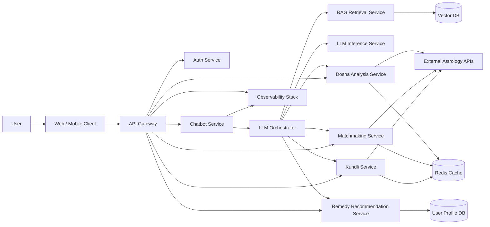

## Service-Level Architecture

### 1. API Gateway

Responsibilities:

- Request routing
- Authentication and authorization enforcement
- Rate limiting
- Request validation
- Versioned API exposure
- Load balancing across backend services

Example routes:

```text
POST /api/v1/kundli/generate
POST /api/v1/matchmaking/analyze
POST /api/v1/dosha/analyze
POST /api/v1/remedies/recommend
POST /api/v1/chat/message
GET  /api/v1/user/profile
```

### 2. Kundli Service

Responsibilities:

- Validate birth date, time, and place
- Normalize timezone and geolocation
- Call deterministic astrology API providers
- Store generated chart metadata
- Cache repeated calculations
- Return structured chart data to downstream services

Output example:

```json
{
  "lagna": "Aries",
  "moon_sign": "Cancer",
  "nakshatra": "Pushya",
  "planetary_positions": [],
  "houses": [],
  "chart_type": "D1"
}
```

### 3. Matchmaking Service

Responsibilities:

- Accept two birth profiles
- Generate or retrieve Kundli data for both users
- Compute compatibility metrics
- Analyze guna matching and important compatibility indicators
- Return a structured compatibility report

### 4. Dosha Analysis Service

Responsibilities:

- Detect doshas from planetary positions and houses
- Explain severity, likely implications, and constraints
- Separate deterministic detection from LLM-based explanation
- Provide confidence and source metadata where applicable

### 5. RAG Retrieval Service

Responsibilities:

- Store astrology reference material in a vector database
- Retrieve relevant domain context for chatbot responses
- Reduce hallucination risk by grounding LLM answers
- Support semantic search over Vedic concepts, remedies, doshas, houses, planets, and nakshatras

RAG pipeline:

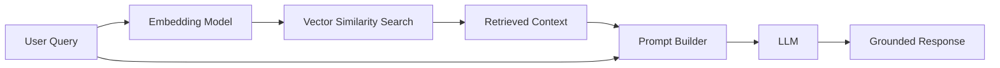

### 6. LLM Orchestrator

Responsibilities:

- Classify user intent
- Decide whether to call RAG, Kundli, Matchmaking, Dosha, or Remedy services
- Build structured prompts
- Enforce response style and safety constraints
- Convert model output into UI-ready responses

Intent examples:

```text
KUNDLI_GENERATION
MATCHMAKING_ANALYSIS
DOSHA_EXPLANATION
REMEDY_RECOMMENDATION
GENERAL_ASTROLOGY_QA
FOLLOW_UP_CONTEXTUAL_CHAT
```

### 7. Remedy Recommendation Service

Responsibilities:

- Generate personalized remedial suggestions using user profile, chart data, dosha results, and retrieved context
- Keep recommendation rules auditable
- Support language and cultural localization
- Separate general wellness suggestions from spiritual or ritual recommendations

## AstroKundli Data Flow

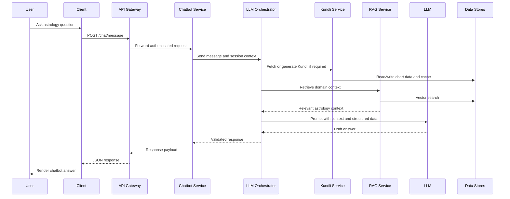

## Scalability Design

- Stateless API and chatbot services for horizontal scaling
- Redis caching for repeated Kundli and compatibility calculations
- Queue-backed workloads for long-running report generation
- Separate LLM inference service to isolate high-cost compute
- Autoscaling on request latency, queue depth, and GPU utilization
- Vector database sharding for large knowledge bases
- Observability on latency, token usage, astrology API error rates, and user satisfaction

## Quality Controls

- Deterministic calculations are handled outside the LLM
- LLM outputs are constrained by retrieved context and structured astrology results
- Guardrails prevent unsupported certainty in predictions
- API responses include confidence, assumptions, and missing-input warnings
- Chat history is session-scoped and privacy-aware

## Example Deployment Topology

```text
Client Apps
   |
API Gateway / Load Balancer
   |
-------------------------------------------------
| Auth | Chatbot | Kundli | Matchmaking | Dosha |
-------------------------------------------------
   |        |          |          |          |
 Redis   Vector DB   PostgreSQL   Astrology APIs
   |
Monitoring + Logs + Metrics + Alerts
```

---

# Project 2: FridgeVision

## Overview

**FridgeVision** is an AI-powered ingredient recognition and meal planning system that detects food items from fridge images, keeps a live inventory, recommends personalized meals, and integrates with smart appliance ecosystems such as Samsung Family Hub and LG ThinQ.

The system is designed around a hybrid edge-cloud architecture to support real-time recognition, responsive user experiences, and food waste reduction.

## Core Capabilities

- Real-time ingredient detection using YOLOv8 and OpenCV
- Approximately 88% mAP and 30+ FPS on standard hardware
- Inventory management from fridge photos
- Personalized meal planning and recipe recommendation
- Expiry-aware and waste-reduction meal suggestions
- Smart appliance integration with Samsung Family Hub and LG ThinQ APIs
- Event-driven architecture for inventory updates and notifications

## Technology Stack

| Layer | Technology |
|-------|------------|
| Computer Vision | YOLOv8, OpenCV, Python |
| Backend | Node.js, Python services, REST APIs |
| Frontend | React |
| IoT | Samsung Family Hub APIs, LG ThinQ APIs, MQTT-style event patterns |
| Data | PostgreSQL, Redis, object storage |
| Deployment | Edge device plus cloud backend |

## High-Level Architecture

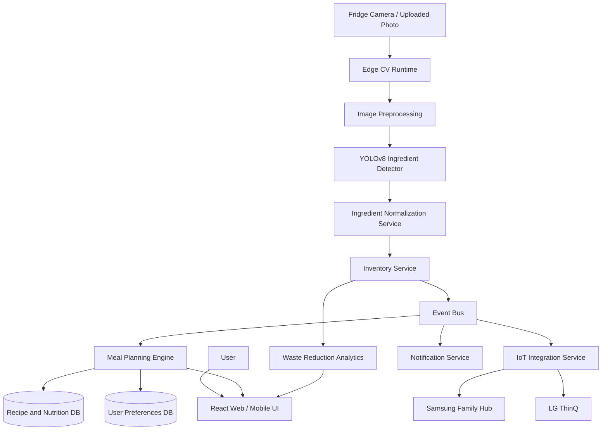

## Component Architecture

### 1. Image Capture Layer

Sources:

- Fridge camera snapshots
- User-uploaded photos
- Smart appliance camera APIs
- Scheduled inventory scans

Responsibilities:

- Capture image frames
- Attach metadata such as timestamp, device ID, and user profile
- Send images to edge CV runtime or cloud inference service

### 2. Edge CV Runtime

Responsibilities:

- Run lightweight image preprocessing
- Execute YOLOv8 inference close to the source
- Reduce cloud bandwidth by sending structured detections instead of raw images when possible
- Support degraded offline mode for basic inventory detection

### 3. YOLOv8 Ingredient Detector

Responsibilities:

- Detect ingredients in fridge images
- Return bounding boxes, labels, confidence scores, and frame metadata
- Handle varied lighting, occlusion, packaging, and overlapping food items

Detection output example:

```json
{
  "image_id": "fridge_scan_001",
  "detections": [
    {
      "label": "tomato",
      "confidence": 0.91,
      "bbox": [120, 85, 260, 230]
    },
    {
      "label": "milk_carton",
      "confidence": 0.87,
      "bbox": [300, 70, 420, 360]
    }
  ]
}
```

### 4. Ingredient Normalization Service

Responsibilities:

- Map detected labels to canonical ingredient names
- Merge duplicate detections
- Estimate item count where possible
- Resolve packaging labels into usable food categories
- Flag low-confidence detections for user confirmation

Example:

```text
milk_carton -> milk
roma_tomato -> tomato
greek_yogurt_container -> yogurt
```

### 5. Inventory Service

Responsibilities:

- Maintain current fridge inventory
- Track item source, quantity, confidence, expiry estimate, and last-seen timestamp
- Reconcile new detections with existing inventory records
- Trigger inventory events when items are added, consumed, expired, or uncertain

### 6. Meal Planning Engine

Responsibilities:

- Recommend recipes using available ingredients
- Incorporate user preferences, allergies, cuisine choices, dietary goals, and expiry urgency
- Rank recipes by match score, nutrition value, preparation time, and waste-reduction impact
- Generate shopping lists for missing ingredients

Ranking features:

```text
recipe_score = ingredient_match + expiry_priority + user_preference + nutrition_score - missing_items_penalty
```

### 7. IoT Integration Service

Responsibilities:

- Sync inventory with smart fridge ecosystems
- Receive appliance telemetry
- Trigger smart appliance actions where supported
- Handle vendor-specific API rate limits and authentication

## FridgeVision Data Flow

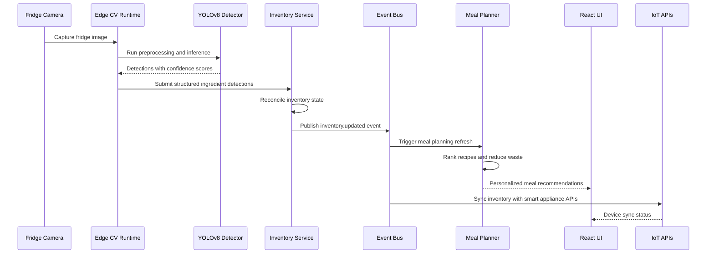

## Event Model

```json
{
  "event_type": "inventory.updated",
  "user_id": "user_123",
  "device_id": "fridge_456",
  "timestamp": "2026-01-01T12:00:00Z",
  "payload": {
    "added": ["tomato", "milk"],
    "removed": ["spinach"],
    "low_confidence": ["cheese_pack"]
  }
}
```

## Edge-Cloud Split

| Responsibility | Edge | Cloud |
|---------------|------|-------|
| Image capture | Yes | No |
| Preprocessing | Yes | Optional |
| YOLO inference | Yes | Optional fallback |
| Inventory history | Partial cache | Yes |
| Recipe ranking | Lightweight fallback | Yes |
| User profiles | No | Yes |
| Analytics | No | Yes |
| IoT API orchestration | Optional | Yes |

## Performance Design

- 30+ FPS target for smooth local inference
- Model pruning or quantization for constrained hardware
- Confidence thresholding for noisy fridge scenes
- Batch processing for scheduled scans
- Async event processing for recipe updates and notifications
- Image retention policies to reduce storage and privacy risk

---

# Project 3: VitalSense

## Overview

**VitalSense** is a multimodal AI preventive health monitoring platform that combines facial analysis, emotion recognition, and fatigue detection to identify early signs of stress, cognitive overload, and wellness risk patterns.

The system is built for real-time use with a PyQt desktop interface and is architected for future integration with ROS2 robotics systems and digital twins.

## Core Capabilities

- Real-time facial analysis
- Emotion recognition
- Fatigue and cognitive overload detection
- Multimodal feature fusion
- Less than 200 ms end-to-end latency target
- PyQt interface for visualization and monitoring
- Future ROS2 and digital twin integration

## Technology Stack

| Layer | Technology |
|-------|------------|
| Computer Vision | OpenCV, Python |
| AI Models | Deep learning models for face, emotion, fatigue, and behavior signals |
| UI | PyQt |
| Robotics Integration | ROS2-ready bridge |
| Data | Local encrypted storage or secure backend |
| Deployment | Desktop, edge device, robotics workstation |

## High-Level Architecture

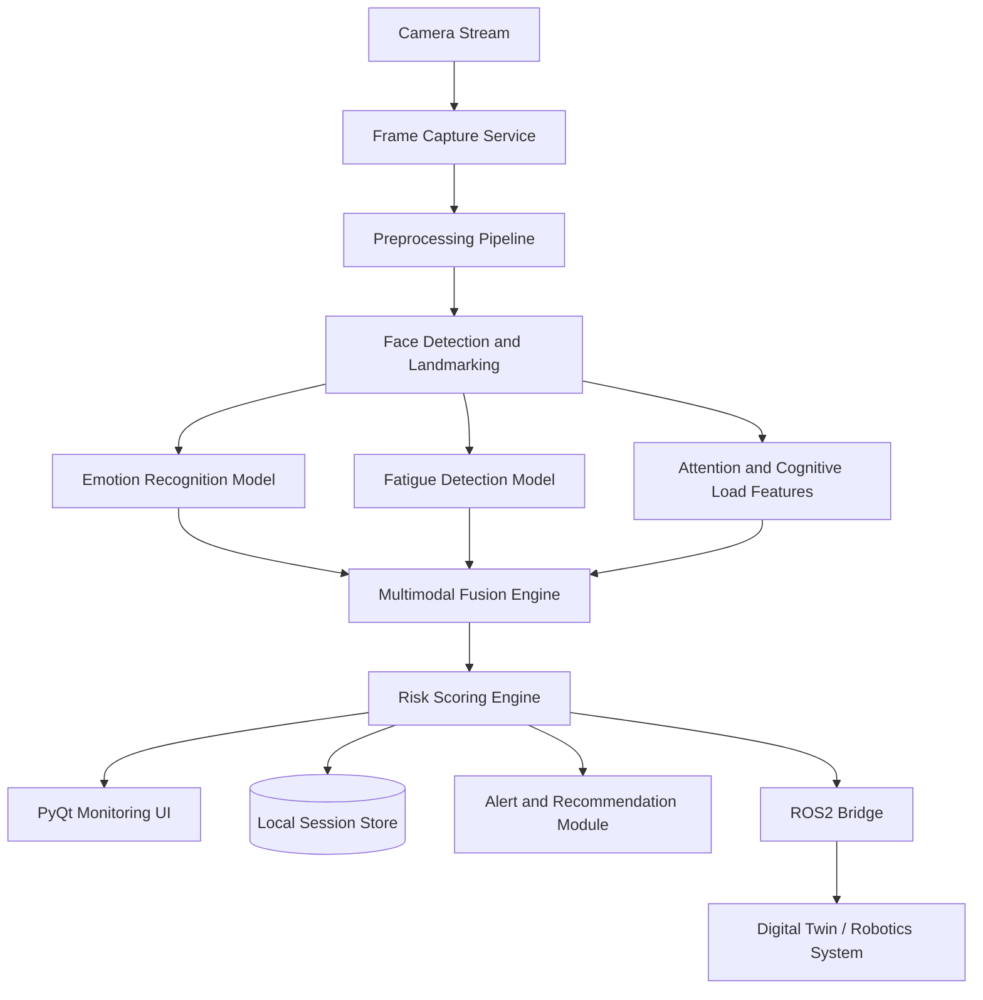

## Component Architecture

### 1. Frame Capture Service

Responsibilities:

- Read webcam or video stream frames
- Normalize frame rate
- Drop stale frames to preserve latency
- Send frames to preprocessing queue

### 2. Preprocessing Pipeline

Responsibilities:

- Resize and normalize frames
- Convert color spaces
- Apply lighting correction if needed
- Prepare model-specific tensors

### 3. Facial Analysis Module

Responsibilities:

- Detect face bounding boxes
- Track face identity within a session
- Extract landmarks such as eyes, mouth, head pose, and gaze direction
- Provide features to downstream fatigue and emotion modules

### 4. Emotion Recognition Module

Responsibilities:

- Predict emotional state from facial features
- Smooth predictions over short time windows
- Reduce jitter using rolling confidence aggregation
- Provide emotion probability distribution to fusion engine

Example output:

```json
{
  "emotion": "stressed",
  "confidence": 0.78,
  "distribution": {
    "neutral": 0.12,
    "happy": 0.05,
    "sad": 0.08,
    "stressed": 0.78
  }
}
```

### 5. Fatigue Detection Module

Responsibilities:

- Detect eye closure patterns
- Estimate blink rate
- Track head pose and micro-nod patterns
- Generate fatigue indicators over time

Potential signals:

```text
PERCLOS
blink_frequency
head_pose_variance
yawn_indicator
gaze_stability
```

### 6. Multimodal Fusion Engine

Responsibilities:

- Combine emotion, fatigue, attention, and temporal features
- Apply smoothing over rolling windows
- Produce a unified wellness state
- Handle missing or low-confidence signals gracefully

Fusion strategy:

```text
wellness_state = weighted_fusion(emotion_score, fatigue_score, attention_score, temporal_trend)
```

### 7. Risk Scoring Engine

Responsibilities:

- Estimate stress, overload, and fatigue risk
- Trigger alerts when risk exceeds thresholds
- Provide interpretable reason codes
- Avoid diagnostic claims and present outputs as wellness indicators

## VitalSense Latency Budget

| Stage | Target |
|-------|--------|
| Frame capture | 10-20 ms |
| Preprocessing | 10-20 ms |
| Face detection and landmarks | 40-70 ms |
| Emotion and fatigue inference | 40-80 ms |
| Fusion and scoring | 5-15 ms |
| UI rendering | 10-20 ms |
| Total | Less than 200 ms |

## Runtime Data Flow

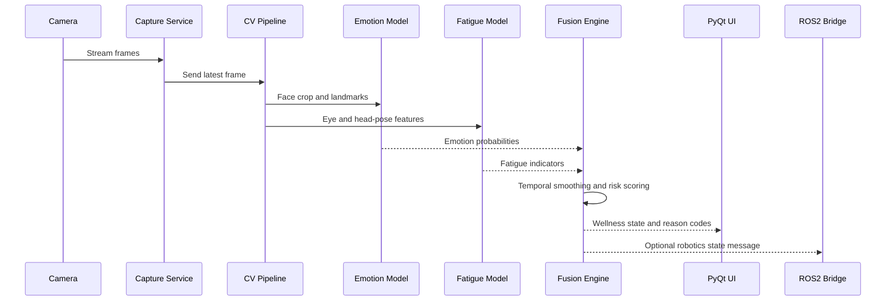

## UI Architecture

The PyQt interface is designed as a live monitoring dashboard.

Suggested panels:

- Camera preview
- Current emotion state
- Fatigue score
- Stress or overload risk indicator
- Timeline chart
- Alert history
- Session summary
- Model confidence indicators

## Future Robotics and Digital Twin Integration

VitalSense can publish wellness-state messages to ROS2 topics.

Example topic design:

```text
/vitalsense/emotion_state
/vitalsense/fatigue_score
/vitalsense/cognitive_load
/vitalsense/session_summary
```

Example ROS2 message payload:

```json
{
  "timestamp": "2026-01-01T12:00:00Z",
  "emotion": "stressed",
  "fatigue_score": 0.72,
  "cognitive_load": 0.81,
  "confidence": 0.76
}
```

## Safety Note

VitalSense is intended for preventive wellness monitoring and research-oriented insight. It should not be presented as a medical diagnostic tool without clinical validation, regulatory review, and appropriate safety controls.

---

# Project 4: YOLOv8 Real-Time Object Detection Framework

## Overview

The **YOLOv8 Real-Time Object Detection Framework** is a reusable production-grade object detection pipeline for custom datasets. It supports data annotation, augmentation, training, evaluation, optimization, deployment, and feedback-driven improvement.

The framework achieved approximately 90% detection accuracy on custom datasets and reduced inference time by approximately 45% through model quantization and TensorRT optimization.

## Core Capabilities

- End-to-end YOLOv8 object detection lifecycle
- Custom dataset preparation and annotation
- Data augmentation and class balancing
- Model training and evaluation
- Quantization and TensorRT acceleration
- Optimized real-time serving
- Robotics perception transfer
- Reusable MLOps structure for future CV projects

## Technology Stack

| Layer | Technology |
|-------|------------|
| Model | YOLOv8 |
| CV Runtime | OpenCV |
| Training | Python, PyTorch, Ultralytics-style training workflow |
| Optimization | Quantization, TensorRT |
| MLOps | Experiment tracking, model registry, evaluation reports |
| Serving | REST/gRPC inference service, edge runtime |

## End-to-End MLOps Architecture

```mermaid
flowchart LR
    Raw[Raw Images / Videos]
    Label[Annotation Tool]
    Dataset[Versioned Dataset]
    Aug[Augmentation Pipeline]
    Train[YOLOv8 Training]
    Eval[Evaluation and Error Analysis]
    Registry[Model Registry]
    Optimize[Quantization and TensorRT]
    Serve[Inference Service]
    Monitor[Runtime Monitoring]
    Feedback[Feedback Samples]

    Raw --> Label
    Label --> Dataset
    Dataset --> Aug
    Aug --> Train
    Train --> Eval
    Eval --> Registry
    Registry --> Optimize
    Optimize --> Serve
    Serve --> Monitor
    Monitor --> Feedback
    Feedback --> Dataset
```

## Pipeline Stages

### 1. Data Collection

Responsibilities:

- Collect images and videos under diverse lighting and environmental conditions
- Include edge cases such as blur, occlusion, partial objects, and unusual viewpoints
- Maintain class distribution metadata

### 2. Annotation

Responsibilities:

- Label bounding boxes for target objects
- Validate label consistency
- Maintain train, validation, and test splits
- Track annotation quality metrics

Example YOLO format:

```text
<class_id> <x_center> <y_center> <width> <height>
```

### 3. Data Augmentation

Augmentation techniques:

- Random brightness and contrast
- Rotation and scaling
- Mosaic augmentation
- Blur and noise injection
- Horizontal flip where semantically valid
- Cropping and perspective transformation

### 4. Training

Responsibilities:

- Train YOLOv8 models on custom datasets
- Track hyperparameters, metrics, and model artifacts
- Compare model variants by accuracy and latency
- Export best-performing checkpoints

Suggested tracked metrics:

```text
mAP50
mAP50-95
precision
recall
F1 score
inference latency
FPS
model size
false positive rate
false negative rate
```

### 5. Evaluation

Responsibilities:

- Validate model accuracy on held-out data
- Generate confusion matrix
- Analyze failure cases
- Identify class imbalance and annotation errors
- Select deployment candidate based on accuracy-latency tradeoff

### 6. Optimization

Responsibilities:

- Apply quantization
- Export to ONNX or TensorRT runtime
- Benchmark latency on target hardware
- Validate optimized model accuracy against baseline

Optimization flow:

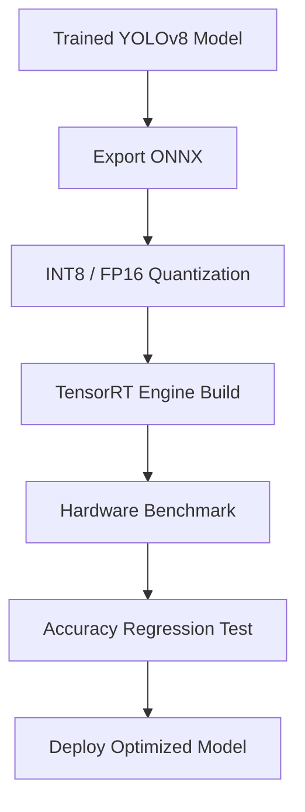

### 7. Serving

Serving options:

| Mode | Use Case |
|------|----------|
| Python batch inference | Offline evaluation and data processing |
| REST API | Web and backend integration |
| gRPC service | High-throughput low-latency inference |
| Edge runtime | Robotics, IoT, and local camera streams |
| ROS2 node | Robotics perception pipeline |

## Runtime Serving Architecture

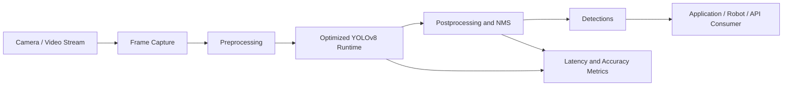

## Robotics Transfer Design

The framework can be reused for robotics perception by wrapping optimized inference in ROS2 nodes.

Suggested ROS2 topics:

```text
/camera/image_raw
/detector/objects
/detector/debug_image
/detector/inference_stats
```

Example detection message:

```json
{
  "class_name": "object",
  "confidence": 0.93,
  "bbox": [100, 120, 240, 320],
  "timestamp": "2026-01-01T12:00:00Z"
}
```

## Quality Gates

A model should pass the following checks before deployment:

- Accuracy threshold on validation and test datasets
- Latency threshold on target hardware
- No severe class-level regression
- Acceptable false-positive and false-negative profile
- Successful export and optimized runtime validation
- Reproducible training configuration

---

# Project 5: EmpathBot

## Overview

**EmpathBot** is an emotion-aware human-robot interaction system that uses computer vision and ROS2 to detect human emotional and behavioral cues in real time. The system converts perception outputs into adaptive robot responses, supporting more natural, context-aware, and emotionally intelligent assistive applications.

## Core Capabilities

- Real-time emotion detection
- Behavioral cue recognition
- ROS2-based modular robotics architecture
- Adaptive response policies
- Context-aware human-robot interaction
- Foundation for emotionally intelligent assistive robotics

## Technology Stack

| Layer | Technology |
|-------|------------|
| Perception | Python, OpenCV, deep learning models |
| Robotics Middleware | ROS2 |
| HRI Logic | Behavior policy engine, state machine or rule engine |
| Robot Integration | ROS2 publishers, subscribers, action clients |
| Observability | Topic logs, bag files, runtime metrics |

## High-Level Architecture

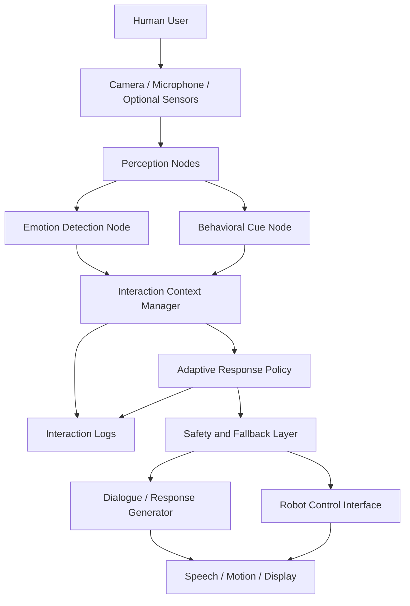

## ROS2 Node Architecture

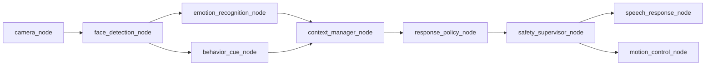

## Topic Design

| Topic | Publisher | Subscriber | Purpose |
|-------|-----------|------------|---------|
| `/camera/image_raw` | Camera node | Face detection node | Raw camera frames |
| `/perception/face_landmarks` | Face detection node | Emotion and behavior nodes | Face geometry and tracking |
| `/hri/emotion_state` | Emotion node | Context manager | Emotion probabilities and confidence |
| `/hri/behavior_cues` | Behavior node | Context manager | Attention, gaze, posture, engagement signals |
| `/hri/context_state` | Context manager | Response policy | Aggregated interaction context |
| `/hri/response_action` | Policy node | Speech and motion nodes | Selected robot response |
| `/safety/fallback` | Safety supervisor | Robot interface | Safe response override |

## Perception Pipeline

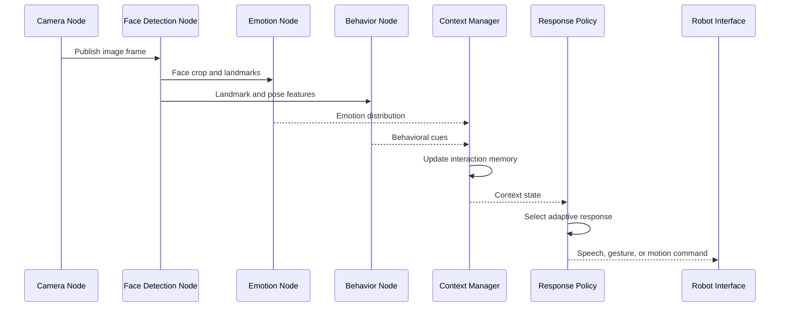

## Adaptive Response Policy

The response policy maps perception signals and interaction history into robot actions.

Example policy logic:

```text
IF user_emotion == "confused" AND engagement_low:
    robot_action = "slow_down_and_explain"

IF user_emotion == "sad" AND confidence_high:
    robot_action = "use_supportive_tone"

IF user_emotion == "angry" AND stress_detected:
    robot_action = "deescalate_and_offer_pause"

IF perception_confidence_low:
    robot_action = "neutral_safe_response"
```

## Context Manager

Responsibilities:

- Maintain short-term interaction state
- Smooth noisy emotion predictions
- Combine facial, behavioral, and dialogue signals
- Track engagement changes over time
- Provide explainable state to policy engine

Example context state:

```json
{
  "emotion": "confused",
  "emotion_confidence": 0.74,
  "engagement": "low",
  "attention_score": 0.48,
  "interaction_phase": "instruction",
  "recommended_policy": "clarify_and_slow_down"
}
```

## Safety and Fallback Layer

Responsibilities:

- Prevent overconfident emotional claims
- Use neutral responses when model confidence is low
- Avoid sensitive inferences beyond the observed interaction
- Allow manual override by operator
- Log actions for review and improvement

## Integration With Other Projects

EmpathBot can reuse components from other projects:

| Source Project | Reusable Component | Benefit |
|---------------|--------------------|---------|
| VitalSense | Emotion, fatigue, cognitive load pipeline | Better human-state awareness |
| YOLOv8 Framework | Optimized real-time perception stack | Faster deployment on robotics hardware |
| AstroKundli AI | Conversational orchestration pattern | Structured dialogue flow and retrieval |
| FridgeVision | Edge-cloud event architecture | Reliable sensor event handling |

---

# Cross-Project Engineering Patterns

## Common Architecture Patterns

| Pattern | Used In | Benefit |
|--------|---------|---------|
| Microservices | AstroKundli AI, FridgeVision | Independent scaling and clean service boundaries |
| RAG | AstroKundli AI | Grounded domain-specific chatbot responses |
| Edge inference | FridgeVision, VitalSense, YOLOv8, EmpathBot | Lower latency and privacy-aware processing |
| Event-driven architecture | FridgeVision, EmpathBot | Decoupled sensor, inference, and action workflows |
| ROS2 messaging | VitalSense, EmpathBot, YOLOv8 robotics transfer | Robotics integration and modular perception |
| Model optimization | YOLOv8, FridgeVision | Better FPS and reduced inference cost |
| Confidence-aware UX | All projects | Safer and more transparent AI outputs |
| Observability | All projects | Production monitoring and debugging |

## Shared Observability Metrics

| Category | Metrics |
|----------|---------|
| API | Request latency, throughput, error rate, status codes |
| LLM | Token usage, latency, retrieval hit rate, fallback rate |
| CV Models | FPS, inference latency, confidence distribution, false positives |
| MLOps | Dataset version, model version, mAP, precision, recall, drift |
| Robotics | Topic latency, dropped frames, action success rate |
| User Experience | Session duration, recommendation acceptance, feedback score |

## Testing Strategy

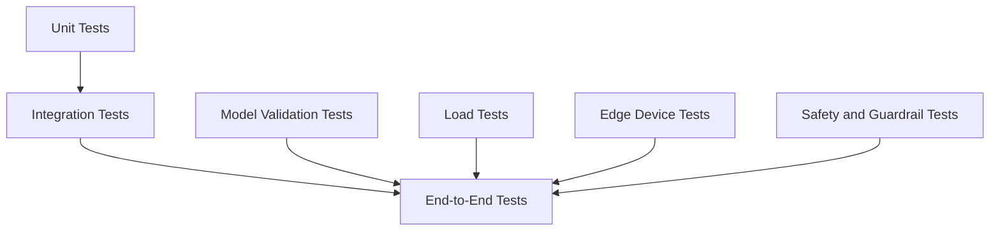

Recommended test categories:

- Unit tests for business logic and utility modules
- API contract tests for service boundaries
- Model regression tests for accuracy and latency
- Load tests for high-concurrency backend services
- Edge-device benchmarks for FPS and memory usage
- ROS2 simulation tests for robotics workflows
- Safety tests for uncertain, sensitive, or ambiguous AI outputs

---

# Security, Privacy, and Responsible AI

## Security Controls

- Authentication and authorization for user-specific data
- API rate limiting and abuse protection
- Secrets management for third-party APIs
- Encrypted storage for sensitive user records
- TLS for client-server and service-service communication
- Role-based access for dashboards and admin tools
- Audit logs for high-impact actions

## Privacy Controls

- Minimize retention of raw images and video frames
- Store derived features when possible instead of raw biometric data
- Provide user consent flows for camera-based systems
- Use local processing for sensitive CV workloads when possible
- Allow user data deletion and export
- Separate personal identifiers from model telemetry

## Responsible AI Controls

- Display confidence where relevant
- Use fallback responses for low-confidence predictions
- Avoid unsupported claims, especially for health and emotion inference
- Separate deterministic calculations from generative explanations
- Keep human override paths for robotics and health-related systems
- Maintain evaluation datasets that represent expected deployment conditions

---

# Deployment Strategy

## Containerized Deployment

Each service can be containerized independently.

```text
api-gateway
chatbot-service
rag-service
kundli-service
cv-inference-service
inventory-service
meal-planner-service
vitalsense-ui
ros2-perception-node
object-detection-serving
empathbot-policy-node
```

## Kubernetes-Ready Production Topology

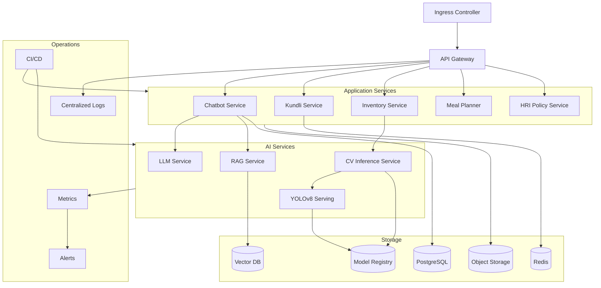

## CI/CD Pipeline


---

# Roadmap

## AstroKundli AI

- Add multilingual support for Hindi and regional Indian languages
- Improve retrieval grounding with curated astrology knowledge sources
- Add personalized daily insights and notification workflows
- Build admin dashboard for analytics and content management

## FridgeVision

- Improve detection for packaged and partially occluded ingredients
- Add barcode and OCR support for packaged food recognition
- Extend recipe personalization using nutrition goals
- Add household-level multi-user inventory support

## VitalSense

- Add additional physiological signals from wearables where available
- Improve temporal modeling for fatigue and stress trends
- Build ROS2 integration demo with assistive robot behavior
- Add privacy-preserving local-only mode

## YOLOv8 Object Detection Framework

- Add automated active learning loop
- Add dataset drift detection
- Benchmark across CPU, GPU, and edge accelerators
- Package ROS2 detection node for robotics projects

## EmpathBot

- Add multimodal dialogue context
- Add voice tone analysis where privacy and consent allow
- Build simulator-based HRI testing environment
- Add configurable response policies for different assistive scenarios

---

# Summary

This portfolio demonstrates end-to-end AI system design across five applied projects:

- **AstroKundli AI** shows scalable LLM/RAG microservices for domain-specific intelligence.
- **FridgeVision** shows real-time computer vision with IoT and edge-cloud architecture.
- **VitalSense** shows multimodal low-latency wellness monitoring with future robotics integration.
- **YOLOv8 Real-Time Object Detection Framework** shows reusable MLOps and optimized model serving.
- **EmpathBot** shows emotion-aware human-robot interaction using ROS2 and adaptive response policies.

Together, the projects represent a cohesive AI engineering portfolio covering backend scalability, real-time inference, responsible AI, MLOps, IoT, and robotics-ready system architecture.

---

# Project 6: Blackjack V3

An advanced, data-driven Blackjack simulation and strategy optimization platform. Built to bridge the gap between classic gameplay and real-time statistical analytics, Blackjack V3 features a dedicated mathematical engine that tracks table telemetry, evaluates deck depths, and calculates optimal strategic play on the fly.


## 🚀 Key Features

* **Real-Time Probability Engine:** Dynamically calculates your active hand win probability based on visible cards and current shoe composition.
* **True Count (TC) Analytics:** Monitors running parameters and outputs precise card-counting metrics ($TC$) to simulate high-level professional play.
* **AI Strategy Advisor:** Instantly flags the mathematically ideal choice (`Hit`, `Stand`, `Double`, `Split`, or `Surrender`) using a dynamic policy evaluator.
* **Modern Dark-Mode UI:** A high-fidelity, distraction-free interface built for streamlined user interactions and clean game-state tracking.

---

## 🏗️ System Architecture

The application relies on a decoupled, modular pipeline separating the rendering layout from the underlying mathematical evaluation layers to ensure minimal calculation latency.


* **UI Layer:** Manages application states, betting interactions, player chip balances, and responsive visual updates.
* **Statistical Engine:** Keeps an active matrix of remaining card frequencies, tracks running math values, and computes deck penetration to deliver precise True Count calculations.
* **Decision Advisor:** Compares current hand weights against the dealer’s upcard matrix to instantly recommend standard basic strategy and adjusted deviations.

---

## 🚀 Deployment Strategy

Blackjack V3 is built with portability, speed, and continuous refinement in mind:

* **Continuous Integration (CI):** Automatic testing workflows validate complex scoring rules, soft vs. hard hands, splitting conditions, and shoe-exhaustion logic upon every commit.
* **Containerization:** Environment states are wrapped in Docker containers to facilitate seamless building and execution across development setups and host platforms.
* **Target Deployments:**
  * **Desktop / Local:** Light, high-performance binary optimized for execution in a localized environment.
  * **Web / Cloud (Planned):** Target compilation via WebAssembly (Wasm) or automated cloud-container hosting to serve the engine calculations inside any web browser.

---

## 🗺️ Roadmap

### Phase 1: Core Mechanics & Analytics 🟢 (In Progress)
- [x] High-fidelity dark-theme interface layout and modern asset styling
- [x] Live deck composition tracking and dynamic True Count ($TC$) calculations
- [x] Predictive probability matrix displaying active hand win rates
- [x] Instant Optimal Action calculation logic (`Hit` / `Stand` / `Double` / `Surrender`)

### Phase 2: Simulation Customization 🟡
- [ ] Multi-deck shoe support (configure 1, 2, 4, 6, or 8 decks dynamically)
- [ ] Rule variant customization toggle (e.g., Dealer hits on Soft 17, Double After Split rules)
- [ ] Session history, performance variance tracking, and profit/loss graphing dashboards
- [ ] Bankroll management utility featuring an integrated Kelly Criterion bet-sizing calculator

### Phase 3: Machine Learning & Mass Simulation 🔵
- [ ] Deep Reinforcement Learning (RL) agent integration to run custom strategy models alongside classic basic strategy
- [ ] Multi-threaded Monte Carlo simulator to run millions of hands instantly for long-term strategic testing
- [ ] Web-based hosting for cross-platform deployment

